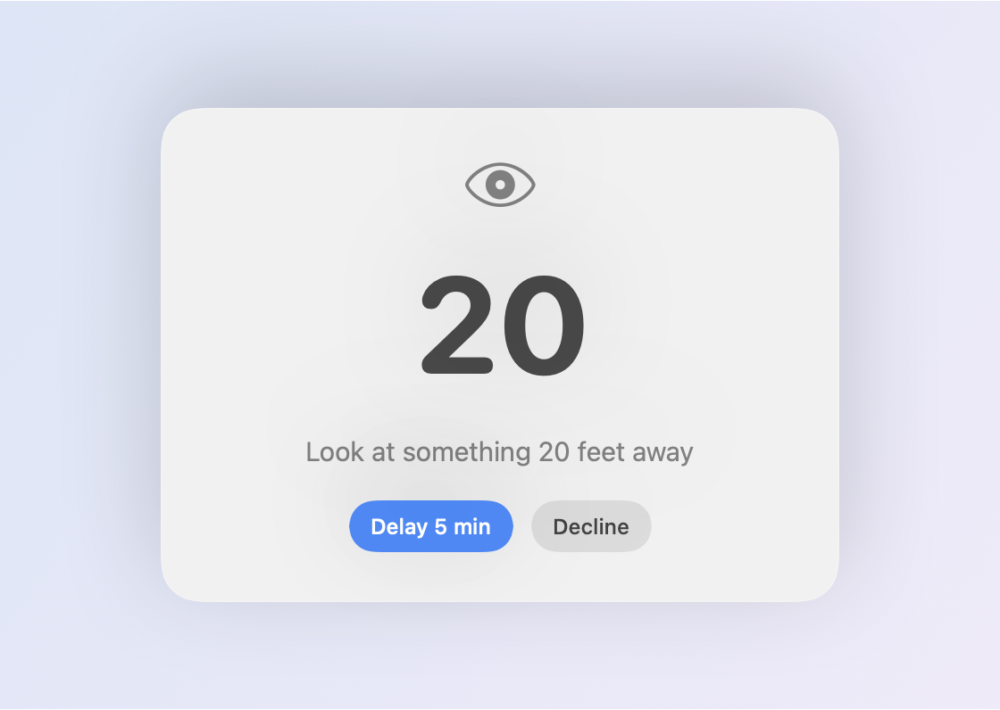

# Look Away

A tiny macOS menu bar app for the 20/20/20 rule: every 20 minutes of screen
time, look at something 20 feet away for 20 seconds.

<p align="center">
  <picture>
    <source media="(prefers-color-scheme: dark)" srcset="docs/popup-dark.png">
    
  </picture>
</p>

## Behavior

- Lives in the menu bar (eye icon). No Dock icon, no main window.
- Every 20 minutes a floating panel appears on the display your cursor is on,
  above every other window, without taking keyboard focus from your current app.
- The panel starts a 20-second countdown the moment it appears. At zero it
  shows "Done", plays a soft chime, and closes itself.
- **Delay 5 min** hides the panel and brings it back later with a fresh
  20-second countdown. Delays can be chained.
- **Decline** closes the panel immediately.
- The next 20-minute interval starts when the panel closes (finished or
  declined), never from a snooze.
- Sleep or screen lock pauses everything; wake or unlock starts a fresh
  20 minutes. Meetings hold reminders the same way, if you switch that on.
- Menu: live "Next break in m:ss", Pause / Resume Reminders, Take a Break Now,
  Launch at Login, Settings, Quit.

Durations live in `Sources/LookAwayCore/Config.swift`.

## Schedule

**Settings…** in the menu opens a schedule panel. It is opt-in: leave it off and
reminders run around the clock, exactly as before.

<p align="center">
  
</p>

- Click the S M T W T F S circles to pick the days reminders should run on.
- One start and end time covers every selected day — set 9:00 AM to 5:00 PM once
  and the whole week follows it.
- Need an exception? **Different hours on some days** reveals a row per selected
  day where any one of them can be given its own start and end. Days with their
  own hours get a dot under their circle; **Reset** puts them back on the shared
  hours. (Right-clicking a day circle offers the same thing.)
- An end time earlier than the start reads as overnight, so 10:00 PM to 2:00 AM
  works for a night shift; the panel marks it "(next day)". The same start and
  end time runs all day.
- Outside the schedule the menu bar shows a moon and the menu reads
  "Outside schedule — back Mon at 9:00 AM". The hold begins the moment the
  window closes. **Take a Break Now** still works.

The schedule is saved to preferences and applied the moment it is edited, without
restarting the current 20 minutes. The settings window closes with ⌘W or Esc and
reopens where you left it.

## Meetings

The same panel can hold reminders while you're on a call. Also opt-in: leave
**Pause reminders during meetings** off and nothing is watched at all.

- **Apps that count as a meeting** is a list of chips over a search field. Type
  to search every app installed on the Mac and click one to add it; click the
  × on a chip to drop it. The first time the panel opens, the meeting apps you
  actually have installed — Zoom, Teams, Slack, Pop, Discord, FaceTime, Webex
  and the browsers — are filled in for you. Clear the list and it stays clear.
- Detection watches **real device use, not which app is in front**: macOS is
  asked which processes are holding an input stream, so a Zoom window sitting
  in the background during a call still counts, and Zoom merely being open does
  not. Every meeting is pinned on a named app that is genuinely on a device;
  activity that can't be attributed to one of your chosen apps is ignored. Neither query records anything, so neither one asks for microphone or
  camera permission. Audio *input* and the camera are what count by default;
  audio output is a separate opt-in, described below.
- **Count camera use too** covers sitting muted but on video. The system only
  reports camera use per device rather than per process, so it can never name
  the app on its own: it counts only while one of your chosen apps is itself on
  the audio devices, playing the call you are listening to. A chosen app merely
  being *open* is not enough, so Photo Booth — or anything else using the
  camera — is never mistaken for a meeting just because Zoom or a browser
  happens to be running.
- **Count audio playing too** is off by default and best left that way. Audio
  coming *out* of an app is a weak signal — a YouTube video, a Slack ping and a
  call all look identical — and browsers and chat apps are in the list above,
  so switching it on will sometimes hold reminders during ordinary browsing.
  Worth it only if you sit in listen-only calls that release the microphone
  entirely; most apps mute in software and keep it open, so they are already
  covered without this.
- **Detection delay** is how long the microphone has to stay busy before it
  counts, so a notification chime or a quick "can you hear me?" doesn't hold
  anything. Once a meeting is on, a 30-second grace period keeps a spell on
  mute — or the gap between two back-to-back calls — from letting a popup
  through.
- **The 20 minutes keeps running through a call.** Only the popup is held
  back, so time on the call still counts towards the next break:
  - A break that came due during the call opens the moment you hang up —
    which is when you most want it, after an hour of staring at faces.
  - A call shorter than the time left just carries on counting, so the break
    lands when it always would have, not 20 minutes after the call.
  - Either way it's one break, not a queue of them.
- A meeting starting mid-break closes the popup, and that break is owed again
  as soon as the call ends, since you never got it.
- While a meeting is on, the menu bar shows a video camera and the menu reads
  "Zoom meeting — next break in 4:32", or "break when you're free" once it's
  already due. That holds even if you **Delay** a break you took by hand
  during the call — being on a call is the more useful thing to be told, and
  the delay's own deadline becomes the one the meeting owes. **Take a Break
  Now** still works, and pausing from the menu still outranks detection.

Capture processes don't always share their app's bundle ID — Zoom captures from
`us.zoom.caphost` alongside `us.zoom.xos`, and Electron apps capture from a
nested helper — so each app carries the ID patterns that belong to it.
Chromium browsers are matched through their helper; Safari hands capture to a
shared WebKit process that doesn't say which browser it came from, so that one
entry covers any WebKit browser.

## Install

There is no prebuilt download. You build the app yourself, which takes about a
minute and needs two things:

- macOS 14 Sonoma or newer.
- Xcode 16 or newer, installed from the Mac App Store and opened once so it
  can finish setting up its command line tools.

Then, in Terminal:

```bash
git clone https://github.com/connortorrell/look-away.git
cd look-away
make install
```

`make install` does everything: it compiles the app, wraps it into
`Look Away.app`, signs it for local use, copies it to your `Applications`
folder, and launches it. Because it's built on your own Mac, there is no
Gatekeeper warning.

When it's running you'll see an eye icon in the menu bar. Click it to see the
time until the next break, pause reminders, or take a break right away. The
first popup arrives 20 minutes after launch.

The app adds itself to your login items the first time it runs from
`Applications`, so it starts automatically after a restart. Turn that off from
the menu with **Launch at Login** if you'd rather start it by hand.

### Updating

```bash
cd look-away
git pull
make install
```

### Uninstalling

Quit Look Away from its menu, then drag `Look Away.app` out of `Applications`
to the Trash. If Launch at Login was on, macOS removes the login item with it.

### Other make targets

| Command        | What it does                                   |
|----------------|------------------------------------------------|
| `make test`    | Runs the scheduler unit tests                  |
| `make run`     | Builds and launches from `./build` (dev loop)  |
| `make bundle`  | Builds the `.app` without launching            |
| `make clean`   | Removes build output                           |

## Layout

- `Sources/LookAwayCore` — pure Foundation: `Config`, the `Timekeeper` clock
  abstraction, the `Schedule` and `MeetingSettings` models and their storage,
  the `MeetingMonitor` debounce, and the `BreakScheduler` state machine.
- `Sources/LookAway` — AppKit/SwiftUI shell: menu bar item, floating panel,
  break view, settings panel, the CoreAudio/CoreMediaIO activity probe and the
  installed-apps scan, sleep/lock observers, launch-at-login.
- `Tests/LookAwayCoreTests` — scheduler, schedule and meeting-detection tests,
  driven by a fake clock and a fake device probe.
