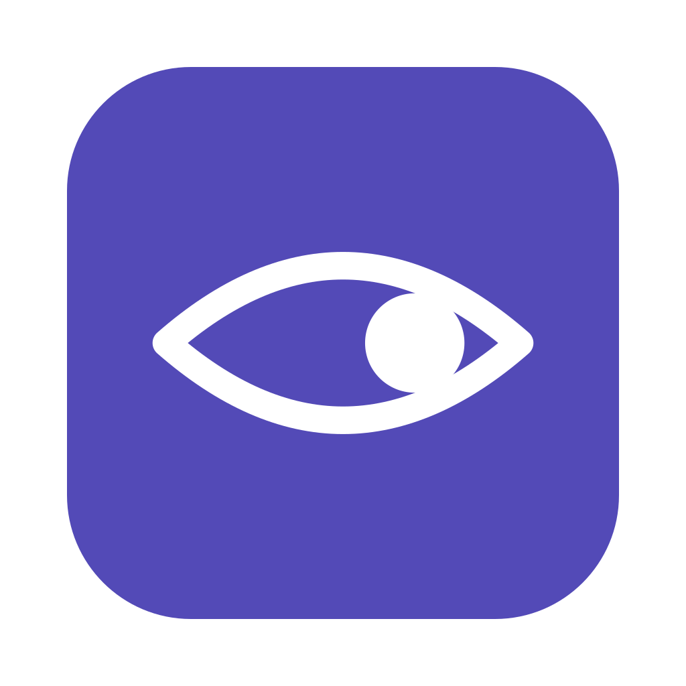
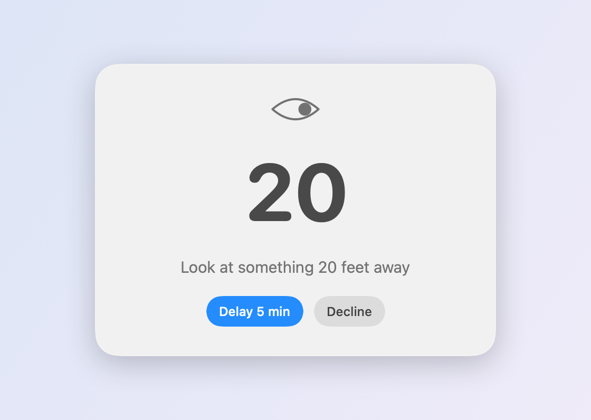
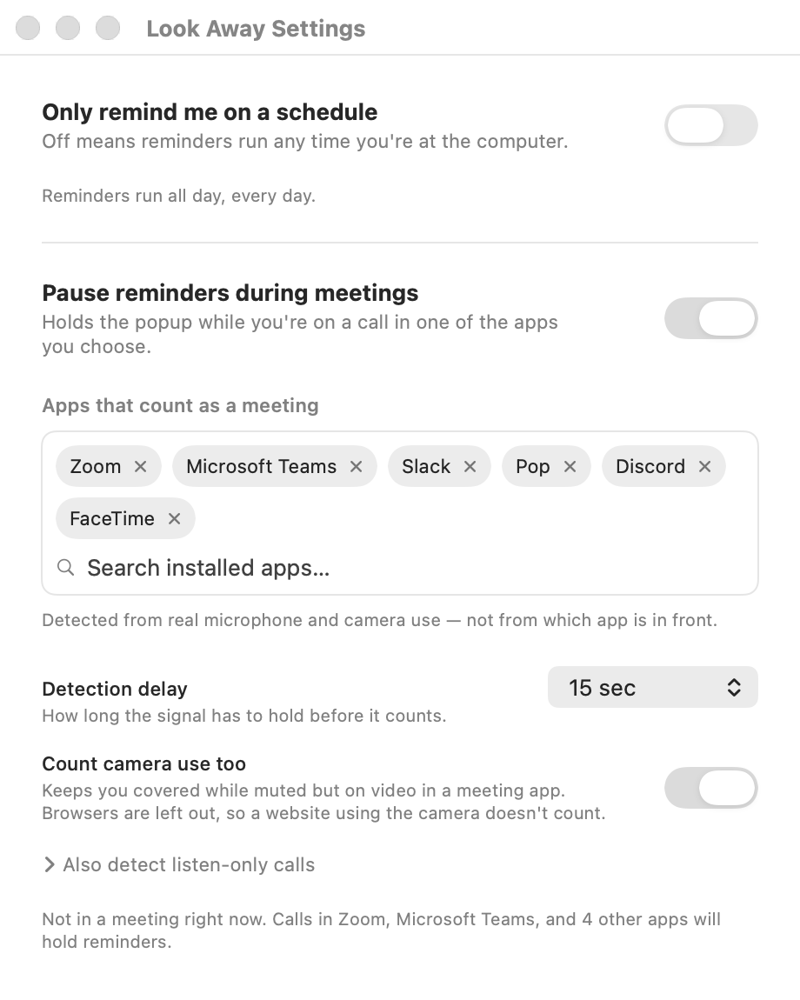
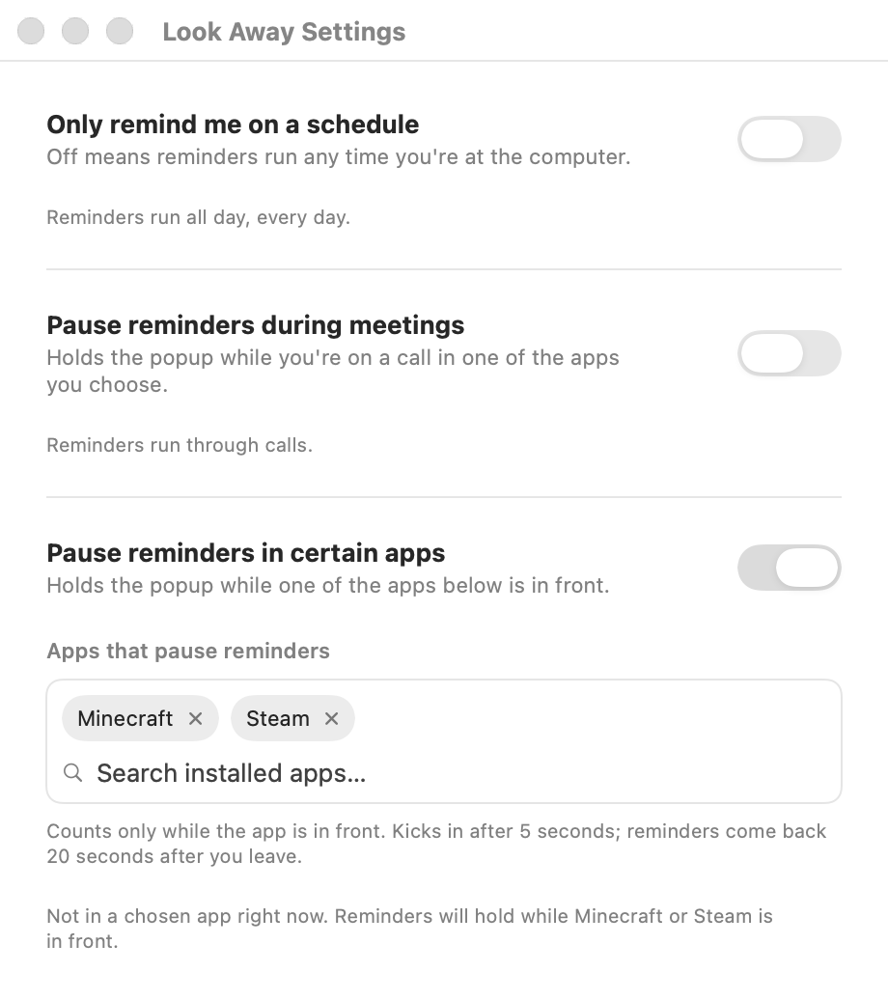
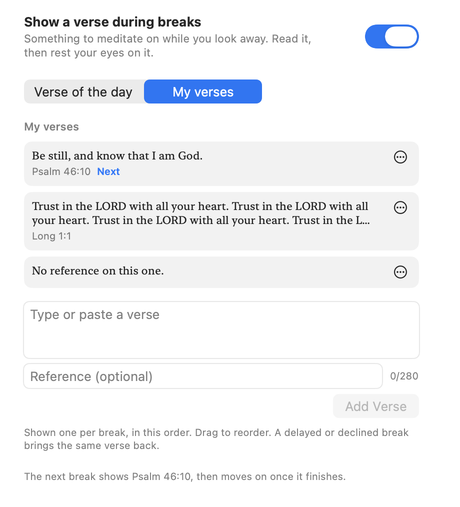

<p align="center">
  
</p>

<h1 align="center">Look Away</h1>

<p align="center">
  A macOS menu bar app for the 20-20-20 rule: every 20 minutes,<br>
  look at something 20 feet away for 20 seconds.
</p>

<p align="center">
  <a href="https://github.com/connortorrell/look-away/releases/latest"></a>
  
  <a href="LICENSE"></a>
</p>

<p align="center">
  <picture>
    <source media="(prefers-color-scheme: dark)" srcset="docs/popup-dark.png">
    
  </picture>
</p>

## Install

Requires macOS 14 Sonoma or later.

1. Download [**LookAway.dmg**](https://github.com/connortorrell/look-away/releases/latest/download/LookAway.dmg).
2. Open it and drag **Look Away** onto **Applications**.
3. Open Look Away from Applications.

Or install with [Homebrew](https://brew.sh):

```bash
brew install --cask connortorrell/tap/look-away
```

The app is signed and notarized by Apple, so it opens without a warning, and
it updates itself.

Look Away lives in the menu bar, with no Dock icon or main window. Once it's
running, an eye icon appears there and the first break comes 20 minutes later.
The first time it runs from Applications, it sets itself to start at login.
Turn that off with **Launch at Login** in its menu.

## How breaks work

- Every 20 minutes a popup opens on the display your cursor is on. It doesn't take
  keyboard focus, so it won't interrupt your typing.
- It counts down 20 seconds, then shows "Done", plays a soft chime and closes.
- **Delay 5 min** brings it back later. **Decline** closes it.
- The next 20 minutes start when the popup closes.
- Sleep or screen lock pauses the timer. You get a fresh 20 minutes when you
  come back.

Click the menu bar icon to see the time until the next break, pause reminders,
take a break now, or open **Settings…**.

## Features

Everything below is optional and off until you turn it on in **Settings…**.

### Schedule

Only get reminders during the hours you choose.

<p align="center">
  
</p>

- Pick the days, and set one start and end time for all of them.
- Give individual days their own hours when you need to.
- Overnight hours work too, for example 10:00 PM to 2:00 AM.
- Outside your hours, the menu bar shows a moon.

### Pause during meetings

Hold reminders while you're on a call.

<p align="center">
  <picture>
    <source media="(prefers-color-scheme: dark)" srcset="docs/settings-meetings-dark.png">
    
  </picture>
</p>

- A call is detected by microphone use, not by which app is in front. Zoom
  open in the background doesn't count. A call in Zoom does.
- Optionally, the camera counts too, for when you sit muted on video.
- The app list comes pre-filled with the meeting apps and browsers you have
  installed. Add or remove any app.
- The 20 minutes keep counting during a call. If a break came due, it opens
  shortly after you hang up.

[More on meeting detection](docs/how-it-works.md#meetings)

### Pause in chosen apps

Hold reminders while a particular app is in front, like a full-screen game.

<p align="center">
  <picture>
    <source media="(prefers-color-scheme: dark)" srcset="docs/settings-apps-dark.png">
    
  </picture>
</p>

- Only the app in front counts. Leaving it open in the background does nothing.
- The 20 minutes keep counting. If a break came due, it opens when you leave
  the app.

[More on chosen apps](docs/how-it-works.md#chosen-apps)

### Verses

Show a Bible verse to meditate on during each break.

<p align="center">
  <picture>
    <source media="(prefers-color-scheme: dark)" srcset="docs/settings-verses-dark.png">
    
  </picture>
</p>

- The break opens with 5 seconds to read the verse. Then the 20-second
  countdown starts, so all 20 seconds are still spent looking away.
- Choose **Verse of the day**, a built-in set of 430 verses from the Berean
  Standard Bible, or **My verses**, your own list in any translation.

[More on verses](docs/how-it-works.md#verses)

## Privacy

- Look Away never records audio or video, and never asks for microphone or
  camera permission. Meeting detection only asks macOS whether those devices
  are in use, and by which app.
- Your settings stay on your Mac. There's no account and no analytics.
- The only network requests are the update check against GitHub Releases and
  the update download itself.

## Updating and uninstalling

Look Away checks for updates at launch and when you open its menu. When a
new release is out, **Install Update** in the menu turns on and shows the new
version. Click it and Look Away downloads the update, checks that it's signed
by the same developer, swaps it in and relaunches, all in a few seconds.
Homebrew users can also run `brew upgrade --cask look-away`.

To uninstall, quit Look Away from its menu and drag it from Applications to the
Trash. macOS removes its login item with it.

With Homebrew, run:

```bash
brew uninstall --cask look-away
```

Add `--zap` to also delete your settings and the update log.

## FAQ

**A break appeared about 30 seconds after my call ended. Why?**
Meeting detection waits 30 seconds after a call seems to end, so a moment on
mute or a gap between back-to-back calls doesn't let a popup through.

**Reminders didn't pause during my call.**
Check the last line of the Meetings settings. It shows what detection sees
right now. If the call app isn't in your list, add it. If you only listen,
with the microphone fully off, turn on **Count audio playing too**, under
*Also detect listen-only calls*. See
[listen-only calls](docs/how-it-works.md#listen-only-calls) for the trade-off.

**Can I change the 20 minutes?**
Not in the app. The durations are set in code, and
[CONTRIBUTING.md](CONTRIBUTING.md#tunables) lists where each one lives.

**An update failed.**
The old version keeps running, and the reason is logged in
`~/Library/Logs/Look Away/update.log`. Downloading the
[latest DMG](https://github.com/connortorrell/look-away/releases/latest) and
installing over the top always works.

## Building from source

```bash
git clone https://github.com/connortorrell/look-away.git
cd look-away
make install
```

This needs Xcode 16 or newer. See [CONTRIBUTING.md](CONTRIBUTING.md) for the
dev loop, tests and project layout, and [docs/releasing.md](docs/releasing.md)
for how releases are published.

## License

[MIT](LICENSE). The built-in verses are from the
[Berean Standard Bible](https://berean.bible), which is in the public domain.
